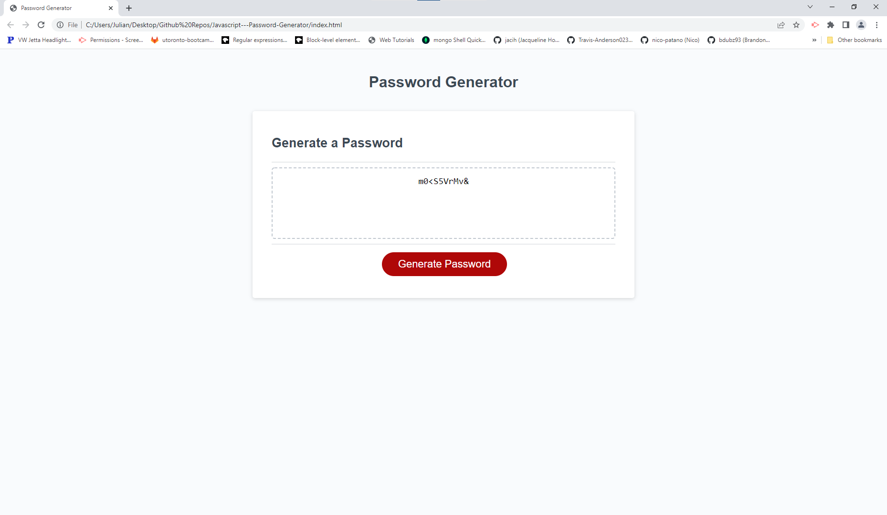

# Password Generator 

## Description

### What does Password Generator do?

Generates a random password based on user criteria.


### Successes and Failures

Project successfully accomplishes all original goals.

## Table of Contents

- [Installation](#installation)
- [Usage](#usage)
- [Credits](#credits)
- [Contribution](#contribution)
- [Questions](#questions)
- [Licence](#licence)

---

## Installation 

### Technologies Used in Development

Technologies used include:

HTML and Javascript

### Installation Instructions

```md
No installation necessary.
```

## Usage



```md
Click generate password button and follow the prompts.
```

## Credits

Bootcamp wrote the index.html file, the javascript was created by me.

## Contribution

Guidelines for contribution:

No contribution necessary

## Questions

No contact.


---
## Licence
This project is covered under the `Mit License`